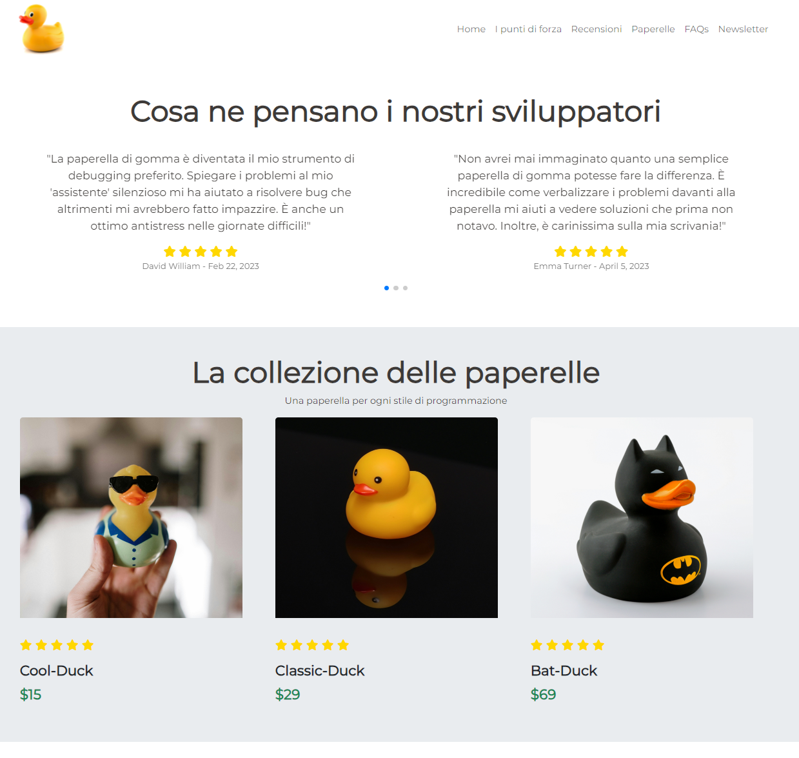
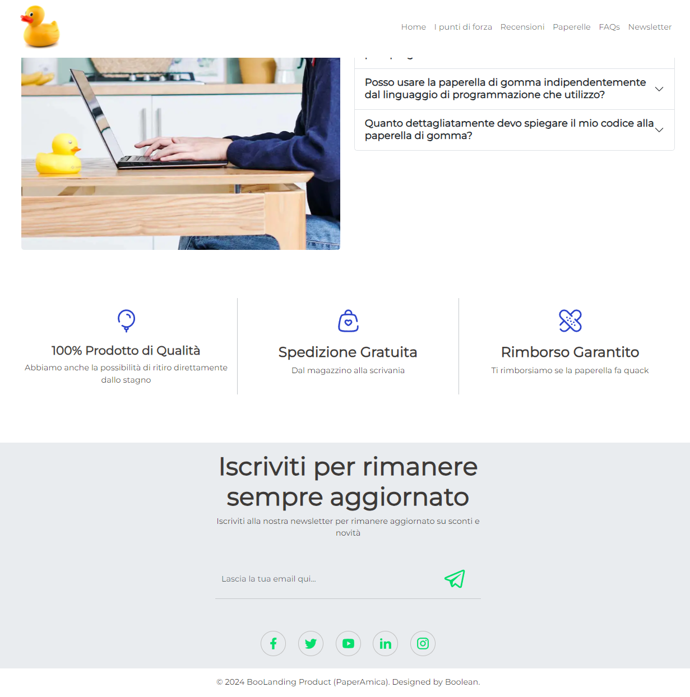
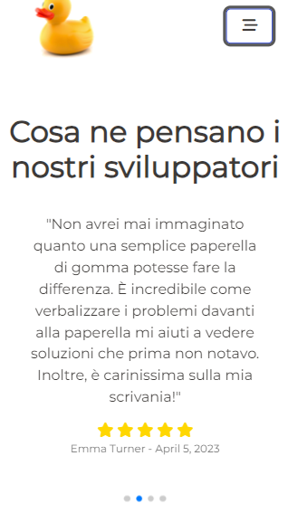

<a name="readme-top"></a>

<!-- BADGE -->


[![LinkedIn][linkedin-shield]](https://www.linkedin.com/in/dorin-vieru-1997dev/)

<!-- LOGO -->
<br />
<div align="center">
  <a href="https://github.com/DorinVieru/landing-page-product">
    
  </a>

  <h3 align="center">Landing Page Product: PaperAmica</h3>

  <p align="center">
    Your best travel companion in code writing!
    <br />
    <a href="https://github.com/DorinVieru/landing-page-product"><strong>View Code »</strong></a> ● 
    <a href="https://paperamica.netlify.app/">View Demo</a>
    <br>
  </p>
</div>


<!-- Index -->
<details>
  <summary>Index</summary>
  <ol>
    <li>
      <a href="#multilanguage">Multilanguage</a>
    </li>
    <li>
      <a href="#covered-topics">Covered Topics</a>
    </li>
    <li>
      <a href="#project-delivery">Project Delivery</a>
      <ul>
        <li><a href="#technologies-used">Technologies Used</a></li>
      </ul>
    </li>
    <li>
      <a href="#getting-started">Getting Started</a>
      <ul>
        <li><a href="#prerequisites">Prerequisites</a></li>
        <li><a href="#installation">Installation</a></li>
      </ul>
    </li>
    <li><a href="#documentation">Documentation</a></li>
    <li><a href="#contacts">Contacts</a></li>
  </ol>
</details>

<!-- Multilanguage -->
## Multilanguage
Read the README in other languages: [README-IT](readme.md).

<!-- Covered Topics -->
## Covered Topics
- HTML & CSS
- JavaScript
- Project scaffold (Vite)
- Responsive approach
- External JS libraries
- Reading documentation
- Writing a readme
- Using Dev Tools


<!-- Project Delivery -->
## Project Delivery

<div>
  <h4>Desktop View</h4>
  
  
  
  <h4>Mobile View</h4>
  
  
  
</div>


🎯 **Objective**

Follow the designer's instructions to reproduce the layout of the provided prototype ([prototype.pdf](public/prototype.pdf)). The prototype is a high-resolution PDF file, so you can zoom in and read the details. There are instructions from left to right on how to create the mobile and desktop versions of the same single page (Landing Page), showing the sequence of what should be displayed on the screen as if you were navigating with a finger or mouse from top to bottom. There are also instructions for colors and typography.

### Milestone

1️⃣ **Milestone 1 (HTML & CSS Structure)**

Start by identifying the macro areas of the layout and identifying similar areas to reuse code, ensuring a simple and semantic HTML structure. Then move on to CSS, faithfully reproducing the assigned layout to position the elements side by side. Create reusable classes to keep the code tidy and reduce duplication. Finally, make sure the CSS code is clean and easy to maintain to facilitate future updates.

2️⃣ **Milestone 2 (Content)**

Once the base is built, proceed with adding the content, following the instructions in the [prototype.pdf](public/prototype.pdf) faithfully.

3️⃣ **Milestone 3 (Interactivity)**

Add interactivity to the page using JavaScript. Specifically, implement the functionality for opening and closing the mobile menu, the FAQs section, and the reviews slider (if you want, try using the Swiper library to create a product reviews slider).

🌟 **Bonus (Email)**

The main purpose of a landing page is to capture visitors' contacts, so the newsletter subscription form should be functional. The implementation was done with <a href="https://www.netlify.com/">Netlify</a>.

<p align="right">(<a href="#readme-top">back to top</a>)</p>

<!-- Technologies Used -->
### Technologies Used

Here are the technologies used for creating PaperAmica:

|      Nome Tecnologia      |                         Icona                                                                |
| :----------------------:  | :------------------------------------------------------------------------------------------: |
|         `Html`            |    [](https://skillicons.dev)               |
|         `Css`             |  [](https://skillicons.dev)                  |
|         `SASS`            |     [](https://skillicons.dev)              |
|       `Bootstrap`         |       [](https://skillicons.dev)       |
|      `Javascript`         |       [](https://skillicons.dev)       |
|         `Vite`            |    [](https://skillicons.dev)               |

<p align="right">(<a href="#readme-top">back to top</a>)</p>


<!-- Getting Started -->
## Getting Started

If you want to install the application locally, there are several steps to follow. I have summarized them below; if there are complications, I refer you to the official documentation for every type of command you need to enter.
<!-- Prerequisites -->
### Prerequisites

First of all, it is essential to initialize/create a new folder locally. We will use the terminal, typing the necessary command to install Vite.

  ```
  npm create vite@latest project_name
  ```
By "project_name" we mean the name of your personal project that you want to create, not the project to clone from GitHub.
<br>
If prompted to install a package (e.g., Need to install the following packages: create-vite@5.3.0), type y to proceed.
<br>
Next, it will ask you to select the framework, choose *Vanilla*, and in the next step, select *JavaScript* as the framework variant.
<br>
Follow the terminal instructions and sequentially type the commands:
  ```
  cd project_name
  ```
It is not necessary to type 'npm install' and 'npm run dev' now.
<br>
Now you can directly open Visual Studio Code from the terminal by typing the command:
  ```
  code .
  ```

<!-- Installation -->
### Installation

_Below is an example of how to clone the repo locally, but it is not the only method. If you are aware of a better method, use it._

1. Once inside Visual Studio Code, open the terminal by going to the menu item 'Terminal' and then 'New Terminal'
2. Clone the repo by typing the following command:
   ```
   git clone https://github.com/DorinVieru/landing-page-product.git
   ```
3. Install npm
   ```
   npm install
   ```
4. Next, you can start the application
   ```
   npm run dev
   ```
You will still see your starting Vite index; in this case, you need to replace the default index of your project folder with the cloned repo's index.
This process must be done for all files (css, scss, js, json).

<p align="right">(<a href="#readme-top">back to top</a>)</p>


<!-- Documentation -->
## Documentation

Here is the list of official documentation for the services used:
- [npm](https://www.npmjs.com/)
- [Vite](https://vitejs.dev/)
- [Swiper](https://swiperjs.com/) (slider for reviews)
- [Netilify](https://www.netlify.com/) (for temporary domain and email sending via form)
- [Bootstrap](https://getbootstrap.com/) (project styling)
- [Google Fonts](https://fonts.google.com/) for the project's main font

<p align="right">(<a href="#readme-top">back to top</a>)</p>


<!-- Contacts -->
## Contacts

Dorin Vieru
- Linkedin: https://www.linkedin.com/in/dorin-vieru-1997dev/
- Email: <a href="mailto:info@dorinvieru.it">info@dorinvieru.it</a>

Project link: [https://github.com/DorinVieru/landing-page-product](https://github.com/DorinVieru/landing-page-product)

<p align="right">(<a href="#readme-top">back to top</a>)</p>


<!-- MARKDOWN LINKS -->
[linkedin-shield]: https://img.shields.io/badge/-LinkedIn-black.svg?style=for-the-badge&logo=linkedin&colorB=555
[linkedin-url]: https://linkedin.com/in/othneildrew
