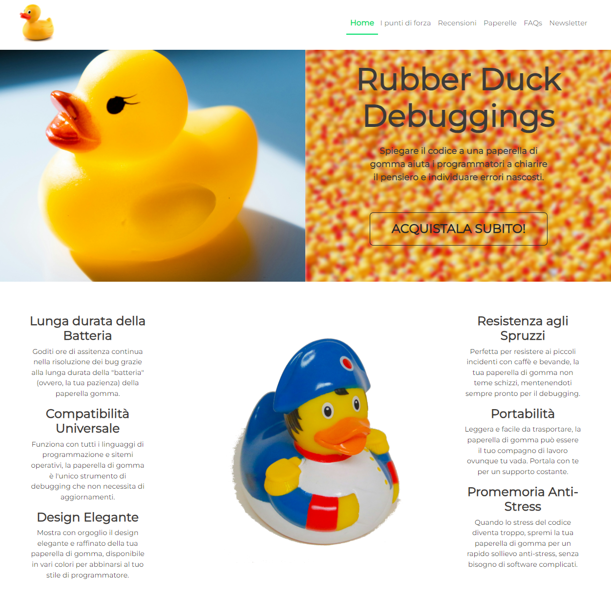
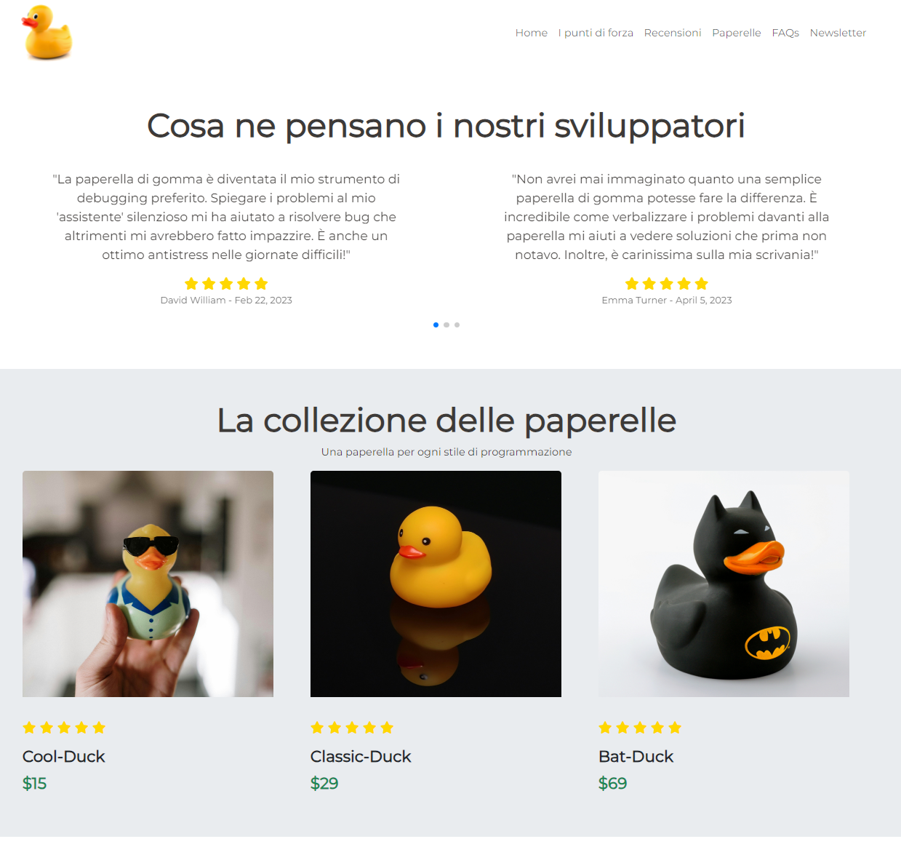
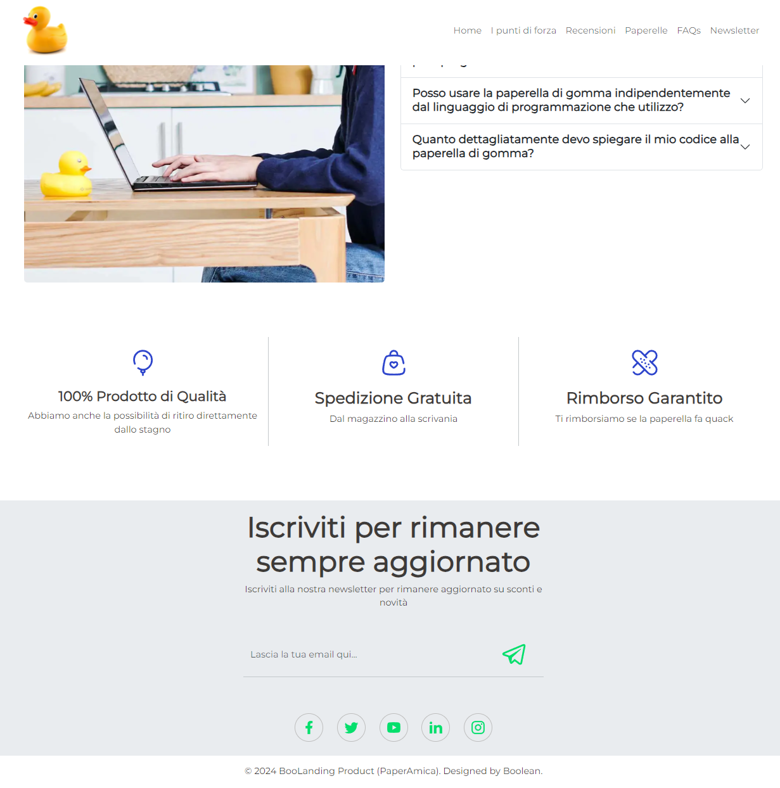
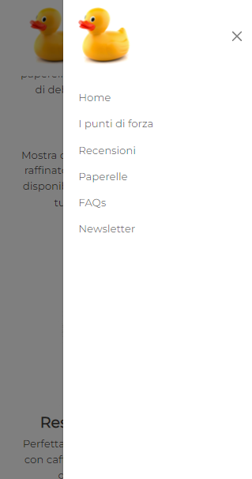
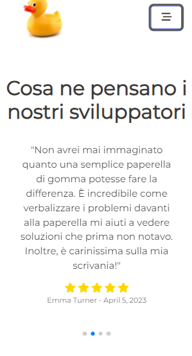
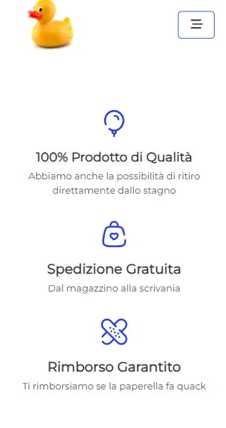

<a name="readme-top"></a>

<!-- BADGE -->


[![LinkedIn][linkedin-shield]](https://www.linkedin.com/in/dorin-vieru-1997dev/)

<!-- LOGO -->
<br />
<div align="center">
  <a href="https://github.com/DorinVieru/landing-page-product">
    
  </a>

  <h3 align="center">Landing Page Product: PaperAmica</h3>

  <p align="center">
    La tua miglior compagna di viaggio nella scrittura del codice!
    <br />
    <a href="https://github.com/DorinVieru/landing-page-product"><strong>Visualizza il codice »</strong></a> ● 
    <a href="https://paperamica.netlify.app/">Visualizza una Demo</a>
    <br>
  </p>
</div>


<!-- INDICE -->
<details>
  <summary>Indice</summary>
  <ol>
    <li>
      <a href="#multilanguage">Multilanguage</a>
    </li>
    <li>
      <a href="#argomenti-trattati">Argomenti trattati</a>
    </li>
    <li>
      <a href="#consegna-del-progetto">Consegna del progetto</a>
      <ul>
        <li><a href="#tecnologie-utilizzate">Tecnologie utilizzate</a></li>
      </ul>
    </li>
    <li>
      <a href="#per-iniziare">Per iniziare</a>
      <ul>
        <li><a href="#prerequisiti">Prerequisiti</a></li>
        <li><a href="#installazione">Installazione</a></li>
      </ul>
    </li>
    <li><a href="#documentazione">Documentazione</a></li>
    <li><a href="#contatti">Contatti</a></li>
  </ol>
</details>

<!-- Multilanguage -->
## Multilanguage
Read the README in other languages: [README-EN](README-EN.md).

<!-- ARGOMENTI TRATTATI -->
## Argomenti trattati
- HTML & CSS
- JavaScript
- Scaffold di un progetto (Vite)
- Approccio responsive
- Librerie JS esterne
- Leggere una documentazione
- Scrivere un readme
- Utilizzo dei Dev Tools


<!-- CONSEGNA -->
## Consegna del Progetto

<div>
  <h4>Desktop View</h4>
  
  
  
  <h4>Mobile View</h4>
  
  
  
</div>


🎯 **Obiettivo**

Seguire le indicazioni del *designer* per riprodurre il layout del prototipo che è stato fornito ([prototype.pdf](public/prototype.pdf)). Il prototipo è un file pdf ad alta risoluzione quindi potete fare zoom e leggere i dettagli. Ci sono le indicazioni da sinistra verso destra su come realizzare la versione mobile e desktop della stessa pagina unica (Landing Page), trovate la sequenza di quello che deve essere mostrato a schermo come se stesse navigando con il dito o con il mouse dall’alto verso il basso. Ci sono inoltre le indicazioni per i colori e la tipografia.

### Milestone

1️⃣ **Milestone 1 (Struttura HTML & CSS)**

Inizia individuando le macroaree del layout e identificando le aree simili per poter riutilizzare il codice, garantendo una struttura HTML semplice e semantica. Passa poi al CSS, riproducendo fedelmente il layout assegnato per posizionare gli elementi affiancati. Crea classi riutilizzabili per mantenere il codice ordinato e ridurre la duplicazione. Infine, assicurati che il codice CSS sia pulito e facile da mantenere per facilitare eventuali aggiornamenti futuri.

2️⃣ **Milestone 2 (Contenuto)**

Una volta realizzata la base, passa all'inserimento del contenuto seguendo fedelmente le istruzioni del [prototype.pdf](public/prototype.pdf).

3️⃣ **Milestone 3 (Interattività)**

Aggiungi interattività alla pagina utilizzando JavaScript. In particolare, implementa la funzionalità di apertura e chiusura del menù mobile, la sezione FAQs e lo slider delle recensioni (se vuoi, prova ad usare la libreria **Swiper** per creare uno slider con le recensioni del prodotto).

🌟 **Bonus (Email)**

Lo scopo principale di una landing page è quello di catturare i contatti dei visitatori, quindi bisognerebbe far funzionare il form di iscrizione alla newsletter. L'implementazione è avvenuta con <a href="https://www.netlify.com/">Netlify</a>.

<p align="right">(<a href="#readme-top">torna all'inizio</a>)</p>

<!-- tecnologie utilizzate -->
### Tecnologie utilizzate

Di seguito le tecnologie utilizzate per la realizzazione di PaperAmica:

|      Nome Tecnologia      |                         Icona                                                                |
| :----------------------:  | :------------------------------------------------------------------------------------------: |
|         `Html`            |    [](https://skillicons.dev)               |
|         `Css`             |  [](https://skillicons.dev)                  |
|         `SASS`            |     [](https://skillicons.dev)              |
|       `Bootstrap`         |       [](https://skillicons.dev)       |
|      `Javascript`         |       [](https://skillicons.dev)       |
|         `Vite`            |    [](https://skillicons.dev)               |

<p align="right">(<a href="#readme-top">torna all'inizio</a>)</p>


<!-- PER INIZIARE -->
## Per iniziare

Se si desidera installare l'applicazione in locale, ci sono diversi passaggi a cui prestare attenzione. Li ho riassunti qui di seguito, qualora ci fossere complicazioni vi rimando alla documentazione ufficila eper ogni tipo di comando che dovete inserire.
<!-- PREREQUISITI -->
### Prerequisiti

Prima di tutto, è essenziale inizializzare / creare una nuova cartella in locale. Useremo il terminale, digitando il comando necessiare per installare vite.

  ```
  npm create vite@latest nome_progetto
  ```
Per "nome_progetto" si intende il nome del vostro personale progetto che desiderate creare, non il progetto da clonare da GitHub. 
<br>
Qualora vi venisse richiesto di installare un pacchetto (per esempio: Need to install the following packages: create-vite@5.3.0) digitate y per procedere.
<br>
Successivamente vi chiederà di selezionare il framework, selezionate *Vanilla*, nel passaggio successivo come variante del framework selezionate *Javascript*.
<br>
Seguite le indicazioni del terminale e digitate il comando:
  ```
  cd nome_progetto
  ```
Non è necessario digitare ora 'npm install' e 'npm run dev'.
<br>
Successivamente è possibile aprire direttamente Visual Studio Code da terminale digitando il comando:
  ```
  code .
  ```

<!-- INSTALLAZIONE -->
### Installazione

_Qui di seguito potete trovare un esempio di come clonare la repo in locale, ma non è l'unico metodo. Qualora foste a conoscenza di un metodo migliore, utilizzatelo._

1. Una volta all'interno di Visual Studio Code, aprite il terminale andando nel voca del menu 'Terminal' e poi 'New Terminal'
2. Clonate la repo digitando il seguente comando
   ```
   git clone https://github.com/DorinVieru/landing-page-product.git
   ```
3. Installate npm
   ```
   npm install
   ```
4. Successivamente potete avviare l'applicazione
   ```
   npm run dev
   ```
Visualizzerete ancora il vostro index di partenza di Vite, in questo caso dovrete sostiruire l'index di dafault della vostra cartella di progetto con l'index della repo clonata.
<br>
Questo processo deve essere fatto per tutti i file (css, scss, js, json, ecc.).

<p align="right">(<a href="#readme-top">torna all'inizio</a>)</p>


<!-- DOCUMENTAZIONE -->
## Documentazione

Qui l'elenco della documentazione ufficiale per i servizi utilizzati:
- [npm](https://www.npmjs.com/)
- [Vite](https://vitejs.dev/)
- [Swiper](https://swiperjs.com/) (slider per le recensioni)
- [Netilify](https://www.netlify.com/) (per il dominio temporaneo e la gestione dell'invio della mail tramite il form)
- [Bootstrap](https://getbootstrap.com/) (stilizzazione del progetto)
- [Google Fonts](https://fonts.google.com/) per il font principale del progetto

<p align="right">(<a href="#readme-top">torna all'inizio</a>)</p>


<!-- CONTATTI -->
## Contatti

Dorin Vieru
- Linkedin: https://www.linkedin.com/in/dorin-vieru-1997dev/
- Email: <a href="mailto:info@dorinvieru.it">info@dorinvieru.it</a>

Link al progetto: [https://github.com/DorinVieru/landing-page-product](https://github.com/DorinVieru/landing-page-product)

<p align="right">(<a href="#readme-top">torna all'inizio</a>)</p>


<!-- MARKDOWN LINKS -->
[linkedin-shield]: https://img.shields.io/badge/-LinkedIn-black.svg?style=for-the-badge&logo=linkedin&colorB=555
[linkedin-url]: https://linkedin.com/in/othneildrew
